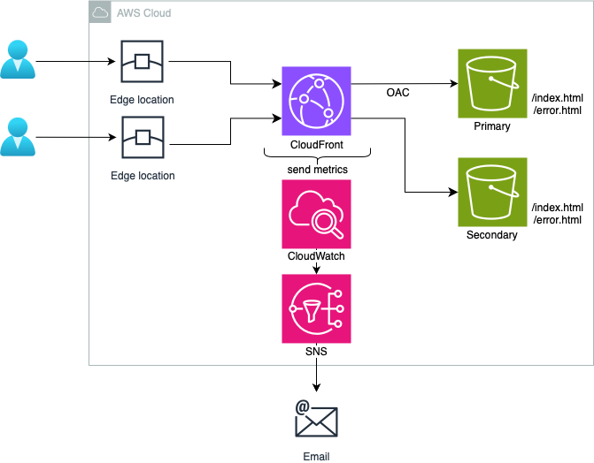

# AWS Static Website with CloudWatch and SNS using Terraform

## Overview

In this project, we deploy a static website on AWS using Terraform, leveraging S3 for scalable, durable storage and content delivery through CloudFront. 

Additionally CloudWatch is utilized for real-time monitoring of the AWS resources while SNS sends immediate alerts when predefined thresholds in CloudWatch metrics are exceeded.

1. Storage and Distribution
    - **AWS S3**: Stores `index.html` and `error.html`, serving as scalable and durable storage for static website files.
    
   - **AWS CloudFront**: Optimizes content delivery globally by caching content at edge locations, with S3 as the origin. Security is enhanced through Origin Access Control (OAC), restricting access to S3 objects via CloudFront.
        - In the event that the primary origin becomes unavailable, CloudFront automatically switches to a secondary origin to serve the content ensuring that content is always available to users.

2. Monitoring and Alerts
    - **AWS CloudWatch**: Monitors key metrics like 4xxErrorRate and 5xxErrorRate for the CloudFront distribution. CloudWatch alarms are configured to trigger notifications when predefined thresholds are exceeded.

   - **AWS SNS**: Sends alerts via email and other endpoints when thresholds are exceeded, ensuring stakeholders are promptly notified of issues for resolution.

 

## Terraform Configuration Files
<!-- (TOC:collapse=true&collapseText=Click to expand) -->

(click to expand)

1. **s3_bucket.tf**: Instantiates the S3 bucket modules for the primary and secondary buckets
    * module "primary_s3_bucket"
    * module "secondary_s3_bucket"

2. **cloudfront_distribution.tf**: Sets up an OAC and CloudFront distribution for delivering a static website hosted on AWS S3
    * aws_cloudfront_origin_access_control
    * aws_cloudfront_distribution

3. **cloudwatch_alarms.tf**: Configuration of IAM permissions and CloudWatch metric alarm for monitoring HTTP 4xx errors on CloudFront
    * aws_iam_policy
    * aws_iam_role 
    * aws_iam_role_policy_attachment 
    * aws_cloudwatch_metric_alarm 

4. **sns.tf**: Sets up an AWS SNS topic for CloudWatch notifications on HTTP 4xx Errors, with email subscription
    * aws_sns_topic 
    * aws_sns_topic_subscription 

5. **modules/s3_bucket/main.tf**: Instantiates the S3 bucket modules for the primary and secondary buckets
    * aws_s3_bucket
    * aws_s3_object (index)
    * aws_s3_object (error)
    * aws_s3_bucket_ownership_controls
    * aws_s3_bucket_public_access_block
    * aws_s3_bucket_versioning
    * aws_s3_bucket_website_configuration
    * aws_s3_bucket_policy
    * data.aws_iam_policy_document

6. **outputs.tf**: Define the outputs you want to display after Terraform applies changes
    * s3_bucket_name
    * **cloudfront_distribution_url**: This output provides the publicly accessible URL for accessing your static website's content.

    

 

## After Deployment

Upon successful deployment of the static website on AWS using Terraform, users can expect the following:

1. **Accessing the Website**: Navigate to the root URL to view the `index.html` page of the static website.

2. **Error Handling**: If an invalid URL is entered, users will be redirected to the `error.html` page, serving as a custom error page.

3. **Monitoring**: If 4xx errors occur frequently, a CloudWatch alarm will be triggered.

4. **Notifications**: After confirming subscription to the topic, stakeholders will receive notifications via email whenever CloudWatch thresholds are exceeded. 

5. **Failover Strategy**: The CloudFront distribution will automatically failover from the primary S3 bucket to the secondary S3 bucket in the event of 500 errors, ensuring continuous content delivery and high availability of static website content.

  
